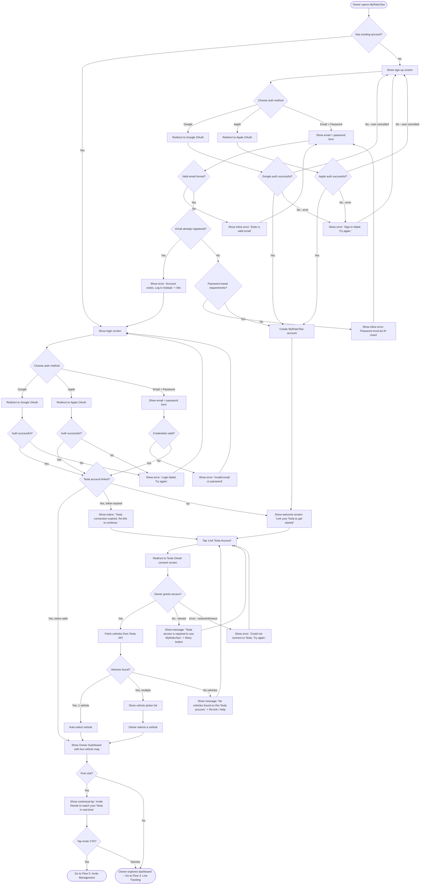
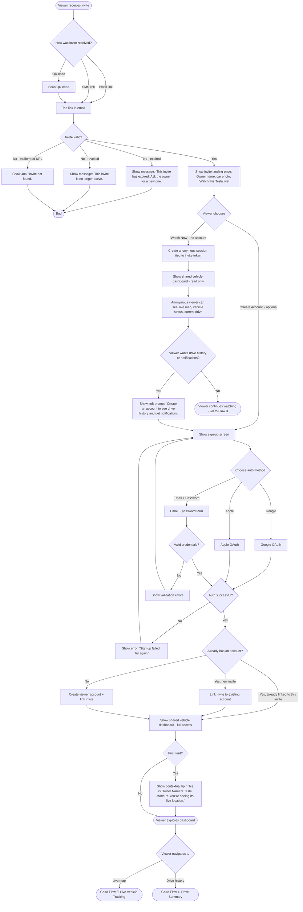
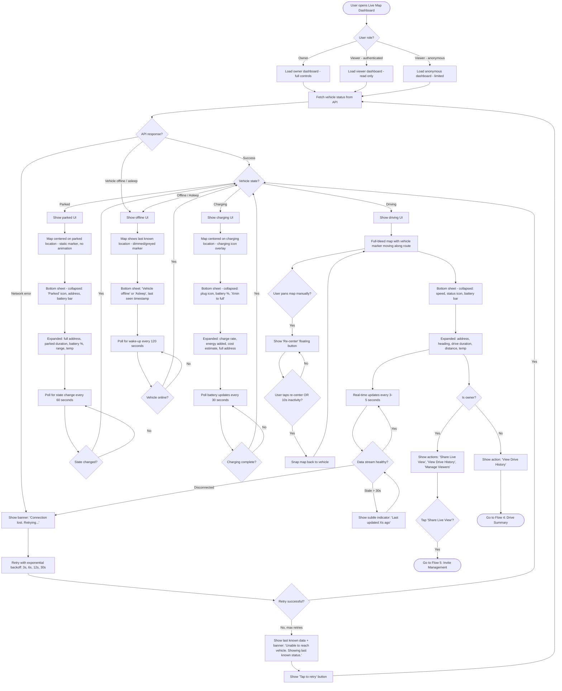
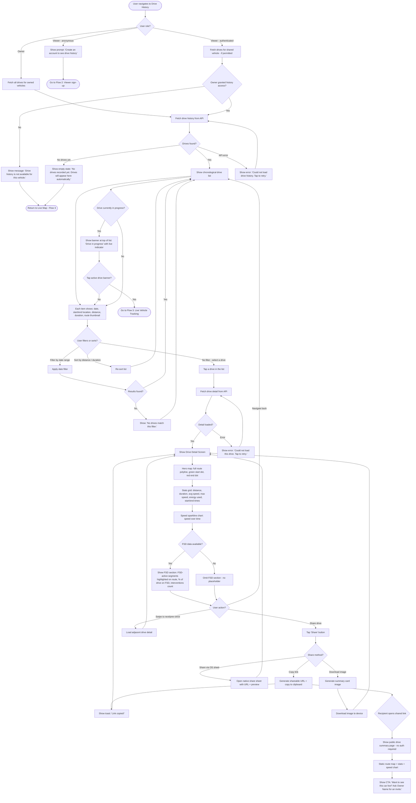
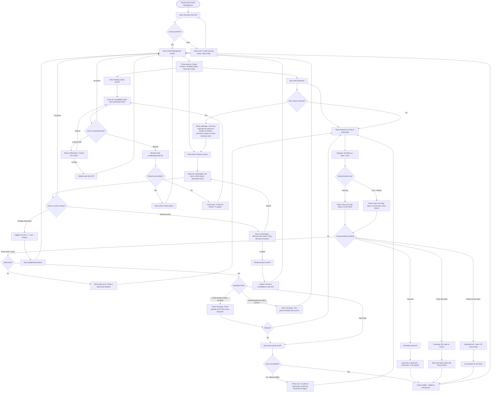
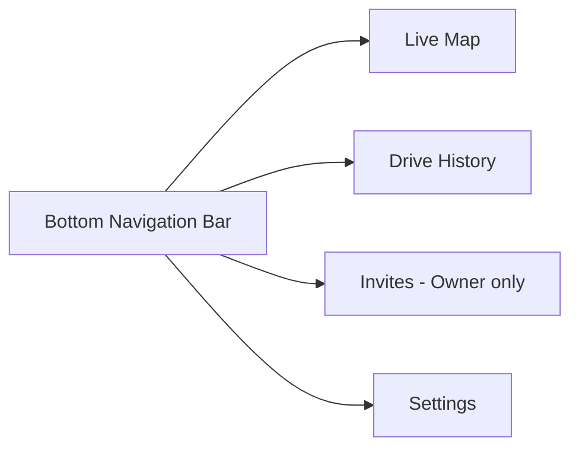
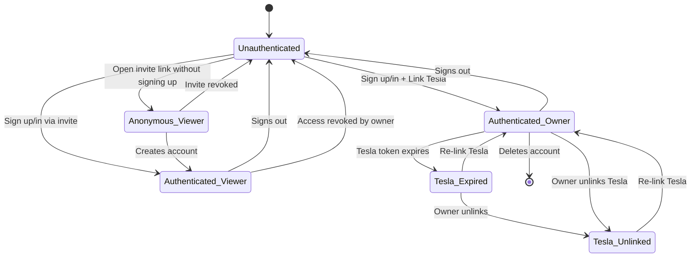

# User Flows -- MyRoboTaxi v1

## v1 Review Feedback -- Flow Changes

The following changes were identified during the first mockup review and supersede the original flow designs below where they conflict:

1. **Dashboard removed as separate screen.** The live map is now the home/default view. There is no intermediate dashboard screen. When the owner logs in or opens the app, they land directly on the live map with their vehicle visible.
2. **Car switching is via swipe on the map, not navigation to a dashboard.** If the owner has multiple vehicles, they swipe left/right on the map view to switch between them. There is no separate vehicle picker or dashboard screen.
3. **Empty state flow for new users.** When a new user has no vehicles linked and no shared vehicles, the home screen shows two options:
   - **"Add Your Tesla"** -- begins the Tesla OAuth linking flow (owner path)
   - **"Enter Invite Code"** -- allows the user to enter a code to view a family/friend's car (viewer path)
   - After either action completes successfully, the user lands on the live map.

> **Note:** The flows below were written before this feedback. References to a `/dashboard` route or "dashboard" screen should be read as the live map home screen instead.

---

This document maps every v1 user journey as a detailed flow diagram. Each flow includes happy paths, branching logic, error states, and edge cases. Flows are rendered in Mermaid syntax for GitHub-native rendering.

**User roles:**
- **Owner** -- A Tesla owner who links their vehicle and manages sharing
- **Viewer** -- A friend or family member invited to watch the owner's vehicle

**Auth strategy:** NextAuth with Google, Apple, and Email/Password. Tesla linking is a separate OAuth step for owners only.

**Key design principle (from competitor research):** Viewer access should ideally work without requiring an account. The viewer flow supports both anonymous (link-only) access and optional account creation for persistent features.

---

## Flow 1: Owner Onboarding

Sign up, link a Tesla account, grant vehicle data access, view linked vehicles, and optionally invite a friend.

### Key decisions

1. **Three auth methods** (Google, Apple, Email+Password) via NextAuth. Google and Apple minimize friction; email+password is the fallback.
2. **Tesla linking is mandatory but separate.** The owner cannot use the app without linking a Tesla account. This is enforced after sign-up/login via a gating check.
3. **Token expiry is handled gracefully.** If the Tesla OAuth token has expired on return visit, the owner sees a clear re-link prompt rather than a broken dashboard.
4. **No vehicles found** is a real edge case (e.g., wrong Tesla account, new account with no car delivered). We surface a clear message and allow re-linking a different account.
5. **Single vehicle auto-select.** Most owners have one car. We skip the picker and go straight to the dashboard.
6. **First-visit invite nudge.** Per competitor research, onboarding should be progressive. We show a single invite CTA contextually, not a tutorial.

---

## Flow 2: Viewer Onboarding

Receive an invite, optionally create an account, and view the shared vehicle.

### Key decisions

1. **Anonymous access is the default path.** Per competitor research recommendation #6 and Lyft/Uber's pattern of browser-based shared views, viewers can watch the live vehicle immediately without creating an account. This is the lowest-friction path.
2. **Account creation is optional but incentivized.** Anonymous viewers can see live status but not drive history or notifications. This provides a natural reason to upgrade without being a gate.
3. **Invite validation happens server-side before showing any UI.** Expired, revoked, and malformed invites fail fast with clear messaging.
4. **Existing accounts are handled.** If a viewer already has a MyRoboTaxi account (e.g., from a different owner's invite), the new invite is linked to their existing account seamlessly.
5. **The invite landing page builds trust.** Showing the owner's name and car photo before asking for any action follows Waymo's trust-building principle.

---

## Flow 3: Live Vehicle Tracking

View the vehicle on a real-time map with status, speed, charge, and contextual information.

### Key decisions

1. **Four distinct vehicle states** (driving, parked, charging, offline) each with tailored UI. The bottom sheet content, map behavior, and polling interval all change based on state.
2. **Polling intervals vary by state.** Driving: 3-5s real-time updates. Charging: 30s. Parked: 60s. Offline: 120s. This balances freshness with API rate limits.
3. **Graceful degradation.** On network failure, the app shows last known data with a clear "stale" indicator and retry options. It never shows a blank screen.
4. **Exponential backoff** for retries prevents hammering the API during outages.
5. **Staleness indicator** appears after 30 seconds without an update during active driving. Users always know how fresh the data is.
6. **Map re-center pattern** follows the universal pattern from Uber/Lyft/Waymo: auto-center by default, show a re-center button when the user pans away, auto-resume after inactivity.
7. **Owner vs. Viewer actions** are distinguished in the expanded bottom sheet. Owners get management controls; viewers get read-only navigation.

---

## Flow 4: Drive Summary

View completed drives, browse history, inspect route details and FSD stats, and share summaries.

### Key decisions

1. **Anonymous viewers cannot access drive history.** This is the primary incentive for account creation. Live status is free; history requires sign-up.
2. **Permission gating for viewers.** Owners control whether each viewer can see drive history (live-only vs. live+history permission levels from the invite system).
3. **Empty state is encouraging, not alarming.** "No drives yet" with an explanation that they appear automatically.
4. **FSD section is conditional.** If the drive has no FSD data (e.g., manual driving, FSD not enabled), the section is omitted entirely rather than showing zeros.
5. **Shareable drive summaries are public.** The shared URL works without authentication, as a standalone web page. This is the key differentiation opportunity identified in competitor research.
6. **Active drive appears as a banner**, not a list item, since it is still in progress. Tapping it goes to the live tracking flow, not the summary flow.
7. **Swipe navigation** between drives allows browsing without returning to the list each time.

---

## Flow 5: Invite Management

Owner sends invites, manages pending/accepted invites, and revokes viewer access.

### Key decisions

1. **Three invite delivery methods.** Email (sends directly), copy link (for messaging apps), QR code (for in-person sharing). All create the same invite record on the backend.
2. **Two permission levels.** "Live only" (real-time map and status) and "Live + History" (adds drive history access). This gives owners granular control without overwhelming complexity.
3. **Duplicate detection.** If the owner tries to invite someone who already has a pending invite or active access, they get a clear message with the option to resend or manage.
4. **Revocation is immediate.** When an owner revokes access, the viewer's session is invalidated in real-time. The viewer sees a "Your access has been removed" message on their next interaction.
5. **Confirmation dialogs for destructive actions.** Both canceling a pending invite and revoking active access require confirmation.
6. **Max viewer limit** is enforced at invite creation time, not at acceptance time. This prevents the owner from having more outstanding invites than the system supports.
7. **Labels are optional but encouraged.** Labels like "Mom" or "Alex" make the invite list human-readable, especially when managing multiple viewers.

---

## Flow 6: Settings and Account

View/edit profile, manage linked Tesla account, and sign out.

```mermaid
flowchart TD
    START([User opens Settings]) --> CHECK_ROLE{User role?}
    CHECK_ROLE -->|Owner| OWNER_SETTINGS[Show Owner Settings]
    CHECK_ROLE -->|Viewer| VIEWER_SETTINGS[Show Viewer Settings]

    %% === OWNER SETTINGS ===
    OWNER_SETTINGS --> OWNER_SECTIONS[Sections: Profile, Tesla Account, Notifications, About, Sign Out]

    %% --- Profile ---
    OWNER_SECTIONS --> EDIT_PROFILE[Tap 'Profile']
    EDIT_PROFILE --> PROFILE_SCREEN[Show profile: display name, email, auth provider, avatar]
    PROFILE_SCREEN --> EDIT_NAME{Edit display name?}
    EDIT_NAME -->|Yes| NAME_INPUT[Show name input field]
    NAME_INPUT --> SAVE_NAME[Save updated name]
    SAVE_NAME --> SAVE_RESULT{Save successful?}
    SAVE_RESULT -->|Yes| NAME_TOAST[Show toast: 'Name updated']
    NAME_TOAST --> PROFILE_SCREEN
    SAVE_RESULT -->|No| SAVE_ERROR[Show error: 'Could not save. Try again.']
    SAVE_ERROR --> PROFILE_SCREEN

    %% --- Tesla Account ---
    OWNER_SECTIONS --> TESLA_SETTINGS[Tap 'Tesla Account']
    TESLA_SETTINGS --> TESLA_STATUS{Tesla link status?}

    TESLA_STATUS -->|Linked, token valid| LINKED_VIEW[Show: Tesla account email, linked vehicles, last sync time]
    TESLA_STATUS -->|Linked, token expired| EXPIRED_VIEW[Show: 'Connection expired' warning + 'Re-link' button]
    TESLA_STATUS -->|Not linked| NOT_LINKED[Show: 'No Tesla account linked' + 'Link Tesla' button]

    LINKED_VIEW --> TESLA_ACTIONS{Action?}
    TESLA_ACTIONS -->|Re-link / refresh| RELINK[Redirect to Tesla OAuth]
    RELINK --> TESLA_OAUTH_RESULT{OAuth successful?}
    TESLA_OAUTH_RESULT -->|Yes| RELINKED_SUCCESS[Show toast: 'Tesla account re-linked']
    RELINKED_SUCCESS --> TESLA_SETTINGS
    TESLA_OAUTH_RESULT -->|No| RELINK_FAIL[Show error: 'Could not re-link. Try again.']
    RELINK_FAIL --> TESLA_SETTINGS

    TESLA_ACTIONS -->|Unlink Tesla| CONFIRM_UNLINK{Has active viewers?}
    CONFIRM_UNLINK -->|Yes| UNLINK_WARNING[Show warning: 'Unlinking will stop all viewers from seeing your vehicle. X active viewers will lose access. Continue?']
    CONFIRM_UNLINK -->|No| SIMPLE_UNLINK[Show confirmation: 'Unlink your Tesla account?']

    UNLINK_WARNING --> UNLINK_CONFIRM{Confirm unlink?}
    SIMPLE_UNLINK --> UNLINK_CONFIRM
    UNLINK_CONFIRM -->|Yes| DO_UNLINK[Remove Tesla tokens, revoke all viewer sessions, clear vehicle data]
    DO_UNLINK --> UNLINKED[Show: 'Tesla account unlinked.' + 'Link Tesla' button]
    UNLINKED --> WELCOME_BACK([Redirect to Link Tesla step - Flow 1])
    UNLINK_CONFIRM -->|No| TESLA_SETTINGS

    EXPIRED_VIEW --> RELINK
    NOT_LINKED --> LINK_CTA[Tap 'Link Tesla']
    LINK_CTA --> RELINK

    %% --- Notifications (Owner) ---
    OWNER_SECTIONS --> NOTIFICATIONS[Tap 'Notifications']
    NOTIFICATIONS --> NOTIF_SCREEN[Show notification preferences]
    NOTIF_SCREEN --> NOTIF_OPTIONS[Toggles: Drive started, Drive completed, Charging complete, Viewer joined]
    NOTIF_OPTIONS --> SAVE_NOTIF[Save preferences]
    SAVE_NOTIF --> OWNER_SETTINGS

    %% --- Sign Out (Owner) ---
    OWNER_SECTIONS --> SIGN_OUT_OWNER[Tap 'Sign Out']
    SIGN_OUT_OWNER --> CONFIRM_SIGNOUT[Show confirmation: 'Sign out of MyRoboTaxi?']
    CONFIRM_SIGNOUT -->|Yes| DO_SIGNOUT[Clear session, redirect to login]
    DO_SIGNOUT --> LOGGED_OUT([Show login screen - Flow 1])
    CONFIRM_SIGNOUT -->|No| OWNER_SETTINGS

    %% === VIEWER SETTINGS ===
    VIEWER_SETTINGS --> VIEWER_SECTIONS[Sections: Profile, Notifications, Shared Vehicles, About, Sign Out]

    %% --- Viewer Profile ---
    VIEWER_SECTIONS --> V_PROFILE[Tap 'Profile']
    V_PROFILE --> V_PROFILE_SCREEN[Show: display name, email, auth provider]
    V_PROFILE_SCREEN --> V_EDIT_NAME{Edit display name?}
    V_EDIT_NAME -->|Yes| V_NAME_INPUT[Show name input]
    V_NAME_INPUT --> V_SAVE_NAME[Save name]
    V_SAVE_NAME --> V_PROFILE_SCREEN
    V_EDIT_NAME -->|No| VIEWER_SETTINGS

    %% --- Shared Vehicles ---
    VIEWER_SECTIONS --> SHARED_VEHICLES[Tap 'Shared Vehicles']
    SHARED_VEHICLES --> VEHICLE_LIST[Show list of vehicles shared with this viewer]
    VEHICLE_LIST --> VEHICLE_ITEM[Each item: Owner name, vehicle name, permission level]
    VEHICLE_ITEM --> LEAVE_ACCESS{Tap 'Leave'?}
    LEAVE_ACCESS -->|Yes| CONFIRM_LEAVE[Show confirmation: 'Stop viewing Owner Name''s vehicle?']
    CONFIRM_LEAVE -->|Yes| REMOVE_SELF[Remove viewer access]
    REMOVE_SELF --> VEHICLE_LIST
    CONFIRM_LEAVE -->|No| VEHICLE_LIST
    LEAVE_ACCESS -->|No| VIEWER_SETTINGS

    %% --- Notifications (Viewer) ---
    VIEWER_SECTIONS --> V_NOTIFICATIONS[Tap 'Notifications']
    V_NOTIFICATIONS --> V_NOTIF_SCREEN[Show notification preferences per vehicle]
    V_NOTIF_SCREEN --> V_NOTIF_OPTIONS[Toggles per vehicle: Car started driving, Car arrived, Charging complete]
    V_NOTIF_OPTIONS --> V_SAVE_NOTIF[Save preferences]
    V_SAVE_NOTIF --> VIEWER_SETTINGS

    %% --- Sign Out (Viewer) ---
    VIEWER_SECTIONS --> SIGN_OUT_VIEWER[Tap 'Sign Out']
    SIGN_OUT_VIEWER --> V_CONFIRM_SIGNOUT[Show confirmation: 'Sign out? You will need your invite link to return.']
    CONFIRM_SIGNOUT_V{Confirm?}
    V_CONFIRM_SIGNOUT --> CONFIRM_SIGNOUT_V
    CONFIRM_SIGNOUT_V -->|Yes| V_DO_SIGNOUT[Clear session, redirect to landing page]
    V_DO_SIGNOUT --> V_LOGGED_OUT([Show home / login screen])
    CONFIRM_SIGNOUT_V -->|No| VIEWER_SETTINGS

    %% --- Delete Account ---
    OWNER_SECTIONS --> DELETE_ACCOUNT[Tap 'Delete Account']
    DELETE_ACCOUNT --> DELETE_WARNING[Show warning: 'This will permanently delete your account, unlink your Tesla, and remove all viewer access. This cannot be undone.']
    DELETE_WARNING --> DELETE_CONFIRM{Type 'DELETE' to confirm}
    DELETE_CONFIRM -->|Confirmed| DO_DELETE[Delete account, unlink Tesla, revoke all invites, purge data]
    DO_DELETE --> DELETED([Show confirmation page: 'Account deleted.' + redirect to home])
    DELETE_CONFIRM -->|Cancel| OWNER_SETTINGS
```

### Key decisions

1. **Owner and Viewer settings are distinct.** Owners have Tesla account management; viewers have shared vehicle management. Both have profile, notifications, and sign-out.
2. **Unlink Tesla is a high-impact action.** If the owner has active viewers, they see an explicit warning about the impact before proceeding. Unlinking revokes all viewer sessions.
3. **Tesla token expiry is surfaced here.** The Settings screen always shows the current link status, making it easy for owners to re-link when tokens expire.
4. **Viewer sign-out warning** reminds them they will need their invite link to return, since viewers may not remember how they got access.
5. **Viewers can leave voluntarily.** The "Leave" action lets viewers remove their own access to a shared vehicle, useful if they no longer want notifications or visibility.
6. **Account deletion** requires typing "DELETE" as a confirmation pattern to prevent accidental data loss. This is a hard delete -- all data is purged.
7. **Notification preferences are per-vehicle for viewers** since a viewer might follow multiple owners' vehicles and want different notification settings for each.

---

## Cross-Flow Notes

### Navigation Architecture

The app has a simple top-level navigation structure:

- **Owners** see four tabs: Live Map, Drive History, Invites, Settings.
- **Authenticated Viewers** see three tabs: Live Map, Drive History (if permitted), Settings.
- **Anonymous Viewers** see only the Live Map with a persistent "Create Account" banner.

### Flow Interconnections

| From Flow | To Flow | Trigger |
|---|---|---|
| Flow 1: Owner Onboarding | Flow 3: Live Tracking | Owner completes onboarding, lands on dashboard |
| Flow 1: Owner Onboarding | Flow 5: Invite Management | Owner taps invite CTA on first visit |
| Flow 2: Viewer Onboarding | Flow 3: Live Tracking | Viewer completes onboarding or enters anonymously |
| Flow 2: Viewer Onboarding | Flow 4: Drive Summary | Authenticated viewer navigates to history |
| Flow 3: Live Tracking | Flow 4: Drive Summary | User taps "View Drive History" in bottom sheet |
| Flow 3: Live Tracking | Flow 5: Invite Management | Owner taps "Share Live View" in bottom sheet |
| Flow 4: Drive Summary | Flow 3: Live Tracking | User taps "Drive in progress" banner |
| Flow 4: Drive Summary | Flow 2: Viewer Onboarding | Anonymous viewer prompted to sign up for history |
| Flow 5: Invite Management | Flow 2: Viewer Onboarding | Invite recipient begins the viewer flow |
| Flow 6: Settings | Flow 1: Owner Onboarding | Owner unlinks Tesla and needs to re-link |

### Global Error Handling

These error patterns apply across all flows:

1. **Network errors** -- Show a non-blocking banner at the top of the screen: "No internet connection. Some features may be unavailable." Retry automatically when connectivity returns.
2. **API errors (5xx)** -- Show a contextual error with a "Try again" action. Never show raw error codes or technical messages.
3. **Session expiry** -- If the user's auth session expires mid-use, show a modal: "Your session has expired. Please sign in again." Redirect to login after acknowledgment. Preserve the user's current location so they return to the same screen after re-auth.
4. **Tesla API rate limiting** -- Silently extend polling intervals. Show a subtle "Updates may be delayed" indicator if the delay exceeds 30 seconds during active driving.
5. **Viewer access revoked mid-session** -- If a viewer is actively watching and the owner revokes their access, show a modal: "The owner has removed your access to this vehicle." Redirect to home.

### Shared UI States

These states appear across multiple flows and should be designed consistently:

1. **Loading** -- A skeleton screen matching the layout of the expected content. Never a full-screen spinner.
2. **Empty** -- Friendly illustration + message + primary action (e.g., "No drives yet" with a link back to the live map).
3. **Error** -- Inline error message near the failed element + "Try again" action. Never a full-page error.
4. **Stale data** -- A subtle timestamp indicator ("Last updated 2 min ago") with muted styling. Appears on live tracking and vehicle status.
5. **Offline** -- Grey/dimmed visual treatment for the vehicle marker and status card. Clear "Vehicle offline" label.

### Progressive Onboarding Tooltips

Contextual tips appear once per user at these moments:

| Moment | Tooltip | Flow |
|---|---|---|
| Owner first lands on dashboard | "Invite friends to watch your Tesla in real-time" | Flow 1 |
| Viewer first sees the live map | "This is [Owner]'s [Car Model]. You're seeing its live location." | Flow 2 |
| First time viewing a drive summary | "The blue line shows the route. Tap anywhere on it for details." | Flow 4 |
| First time in drive history (owner) | "Share any drive summary with the Share button." | Flow 4 |
| Owner opens Invite Management first time | "Invite by email, link, or QR code. You control who sees what." | Flow 5 |

These tips are dismissible and never shown again once acknowledged.

### Authentication State Machine

### Role-Based Access Summary

| Feature | Owner | Authenticated Viewer | Anonymous Viewer |
|---|---|---|---|
| Live map + vehicle status | Yes | Yes | Yes |
| Bottom sheet - expanded details | Yes | Yes | Partial (no actions) |
| Drive history list | Yes | If permitted by owner | No (sign-up prompt) |
| Drive detail + summary | Yes | If permitted by owner | No |
| Share drive summary | Yes | Yes (if has access) | No |
| Invite management | Yes | No | No |
| Tesla account settings | Yes | No | No |
| Notifications | Yes | Yes | No |
| Profile editing | Yes | Yes | No |
